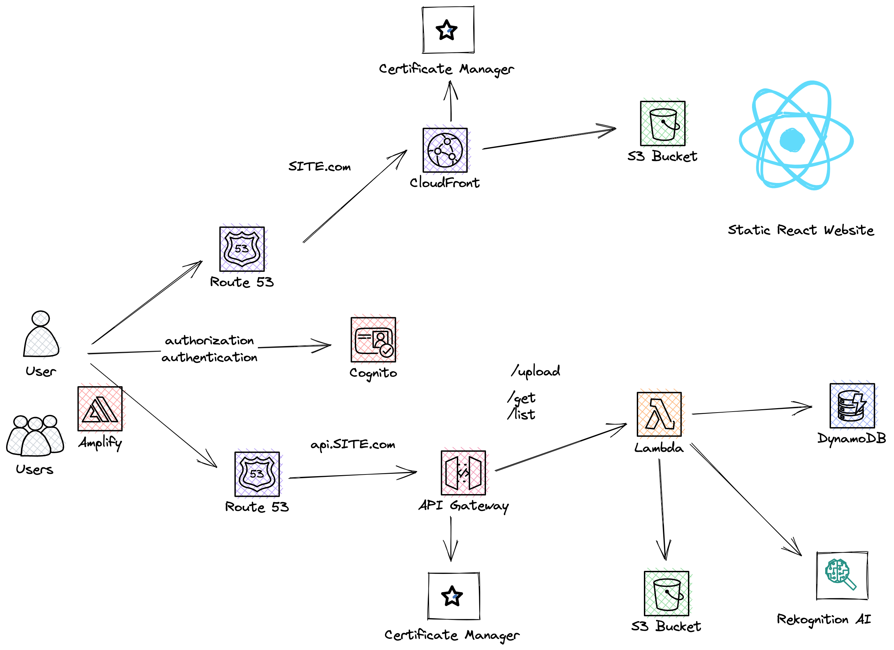
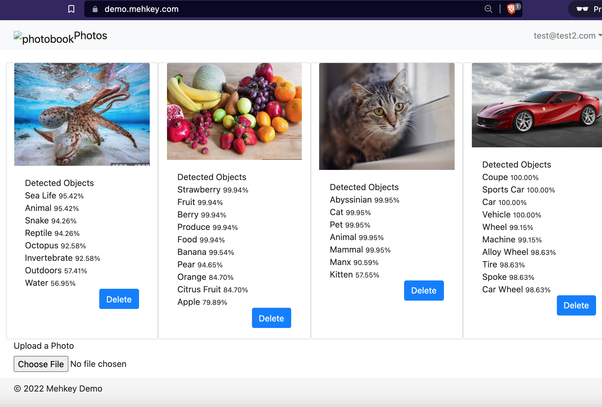
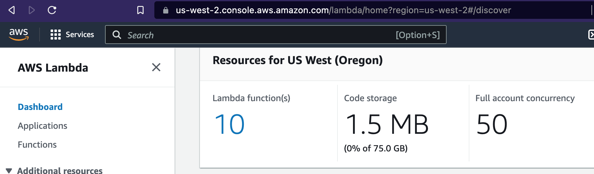
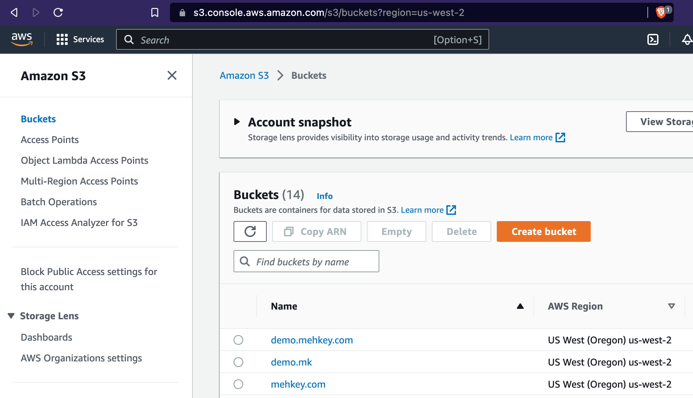
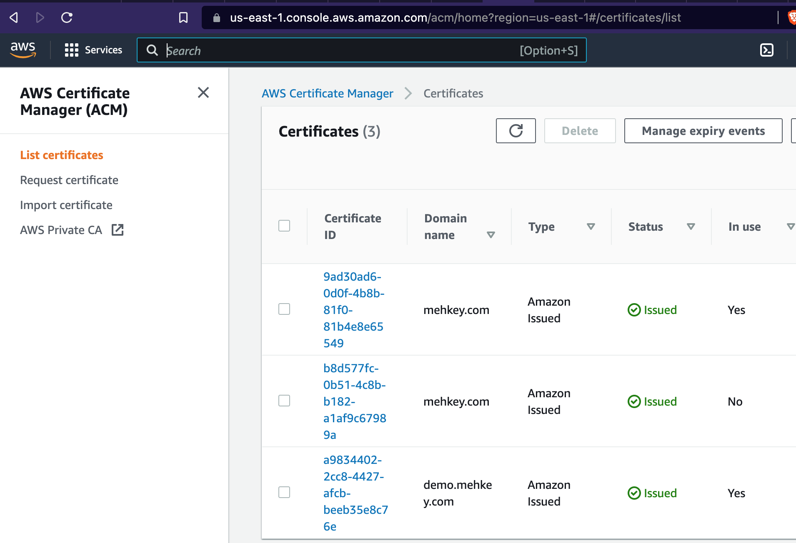

# AWS Image Storage and AI Object Recognition

Demo AWS Photo App A simple photo storage and AI recognition app. The app allows users to sign up, login, logout, upload pictures and the identifies the objects on the picture using AWS Rekognition AI Service. AWS S3 AWS Lambda AWS Cloud Front AWS Cognito AWS IAM AWS Route 53 React Javascript Python Terraform

## [LINK TO THE LIVE APP https://demo.mehkey.com](https://demo.mehkey.com)

## Design 

## Demo 

## AWS Setup

## References

[1] [Microservices in AWS on Oreilly](https://www.oreilly.com/live-events/microservices-on-aws/0636920403999/0636920403982/)

[2] [AWS](aws.com)

